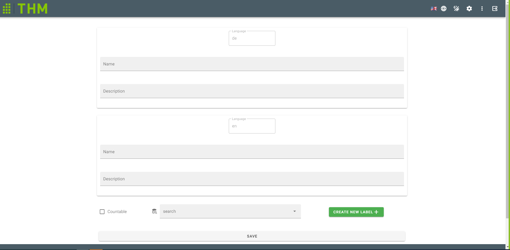

# AddItem.vue

Defines the form for adding new items

## Components
- Components:
    - `v-form`: used to put all input fields
    - `v-text-field`: used to enter the required data (ItemNames, Description etc)  
    - `v-checkbox`: used to define an item which is countable or not
    - `v-autocomplete`: used to search for and select labels. Autocomplete includes Chips and slotted Templates
    - `v-chip`: displays features from the dropdown list
    - `v-list-item`: displays the item of list 
    - `v-list-item-action`: used to select chips from dropdown list
    - `v-list-item-content`: is slot for dropdown list content
    - `v-list-item-title`: displays text content
    - `v-btn`: used to save the item being created
    - `v-snackbar`: displays success or errors messages
    - `create-label`: placeholder for button from createLabel-component
    - `v-row`/`v-col`: used to build layout

## Scripts 
- computed: 
  - `getCurrentNameString()`: get the current name as string connected with i18n tag
- mounted: 
  - `languageDataService.getAll()`: get a list of all the languages on the server
  - `labelDataService.getAll()`: get a list of all existing labels on the server
- methods: 
  - `remove(item)`: Used to remove Item from selected Labels  @param item label which should be removed
  - `getName (item: any)`: Used to get Name based on current language @param item item which has property name
  - `sendItem ()`: is used to send all entered data to the server to create a new item

[_back to documentation_](../)

