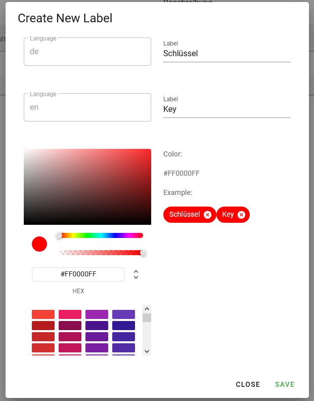

# createLabel.vue

This dialog-window will be open if User needs to create and add new label

## Purpose
Creates a new custom Label with a custom color. 
## Components
- Components: 
  - `v-dialog`: used to open this component as dialog window
  - `v-card`: used to display content
  - `v-card-title`: the header of window 
  - `v-card-text`: used to display text content in a card
  - `v-card-actions`: container for buttons 
  - `v-btn`: buttons like Save, Close or '+'
  - `v-text-field`: used to input some data
  - `v-color-picker`: used to select color for label chip
  - `v-chip`: used to display example of lable
  - `v-row`/ `v-col`/ `v-spacer`: used to build layout

## Scripts
- computed: 
  - chipItem: computed property  to get data from input-fields. The data will be given for label content  
- mounted: 
  - `languageDataService.getAll()`:  get a list of all the languages on the server 
- methods: 
  - ` sendLabel ()`: used to send all entered data to the server to create new label

[_back to documentation_](../)

