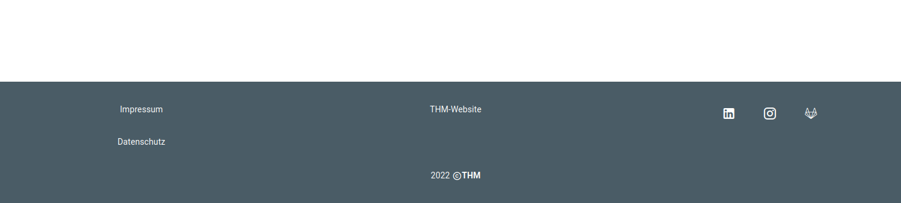

# Footer.vue Component
Provides necessary and informational links at the bottom of the page.

## Purpose
Displays Social Media Links and other helpful Links about the Project
## Components
- The `v-footer` component is used for displaying general information that a user might want to access
    - `color="secondary"` sets the already defined color in the footer
    - `dark` Applies the dark theme variant to the component
- Each of the subpages (Privacy Policy, About us and THM-Website) is included in `v-card-text`
    - The first `v-col` includes Privacy Policy and About us subpages 
    - The second `v-col`  THM-Website
- The Social Media Icons are included into a `v-btn`
- Every Item has its own `v-tooltip`, which is hoovering text 
- with `new Date().getFullYear()` it sets the current Year as a Number
- There are 3 Arrays defined in the data section, which include Name, Href and Tooltip of the Footer 
- `i18n` section -> Defines German/English text

[_back to wiki_](./)
