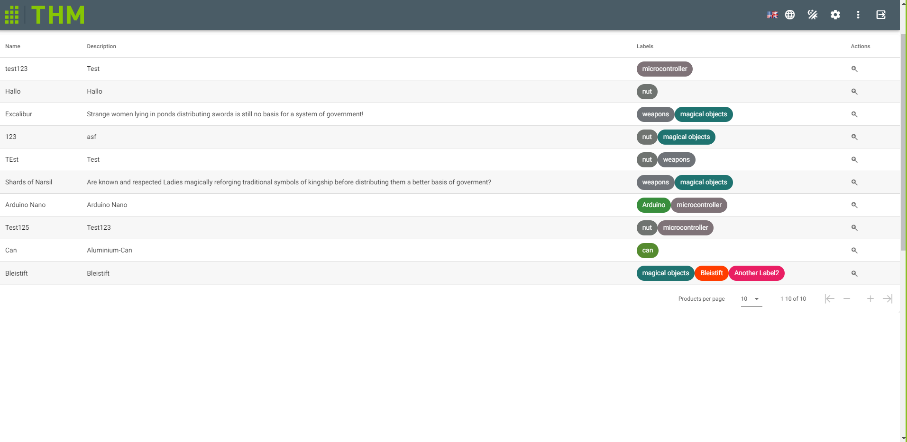

# Grid
Defines the area for the results of the item search.

## Components
`<v-data-table>` -> Is used to display Data of the Current available Items
- the headers of the table are defined in `headers()`
- items collected via Axios with `ItemDataService.getAll` 
- A maximum amount of 10 Items are displayed on each page
- Icons in the footer area of the table are defined in `footerprops()` 

`<i18n>` section -> Defines German/English text
## Scripts

- __computed__:
  - __isMobile__ Checks if the users end device is a mobile device / has a screen width < 760
  - __getLabels__ Automatically gets new Item after pushed in Vuex
  - __headers__ Used to compute values from i18n into the header
  - __headersMobile__ Same for mobile devices
  - __footerprops__ Used to compute value from i18n into footer
- __watch__:
  - __getlabels__ Checks if getItem was triggered (Select Option was triggered in Grid)
- __methods__:
  - __getLabelName(label)__ Returns label in i18n selected language
  - __getAllItems__ Gets all items via axios
  - __getColor__ Returns the color value for a label
  - __isAvailable__ Returns different icons depending on availability of the item
  - __whichColor__ Returns different color depending on availability of the item
  - __addlabelToSearch__ Label gets added into current label search Array in VUEX
  - __openItem__ Item gets added into VUEX State and triggers ItemMenu
- __mounted__:
  - Items are loaded via the Item Data Service
  
[_back to wiki_](./)
