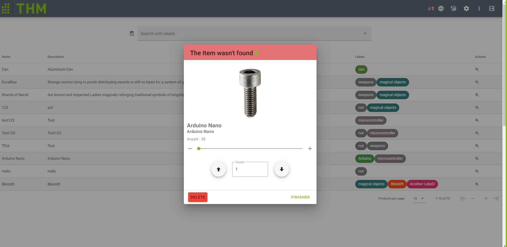

# ItemMenu

## Purpose
Opens when Item is triggered in Grid-Component.
Options to decrease Item-Quantity -> Take something out of shelf.
Triggers the Lights on the shelf to the corresponding Item.

## Components
- `v-dialog`: to blend out Background.
- `v-Card`: to achieve a compact overlay.
- `v-slider`: in/decreases the amount of Items
- `v-card-text`: displays description, quantity and name of the item 
- `v-textfield`: Input of the quantity of the selected item
- `v-btn`: updates the selected Item with its properties

## Methods
- `openItem(item: Item)`: opens an Item from Interface Item defined in types/index.ts 
- `increment()`: increases the quantity of the items, is used in `v-slider` Compomemt
- `decrement()`: decreases the quantity of the items, is used in `v-slider` Compomemt
- `updateItem(take: boolean)`:  updates the quantity of an Item if the item has been taken out
  the item is updated by finding its ID. The selected item is stored in the vuexstore
## Computed
- `getLang()`: gets the selected Language with its i18n tags
- `getItem()`: gets the selected item, stored in vuex store
## Watch
- `dialog()`: turns the corresponding LEDs off, when the `v-dialog` window has been closed
- `getItem(newItem: Item)`: Checks if getItem was triggered (Select Option was triggered in Grid)
- `destroyed()`: turns off LED, by getting Id from item

[_back to documentation_](../)

