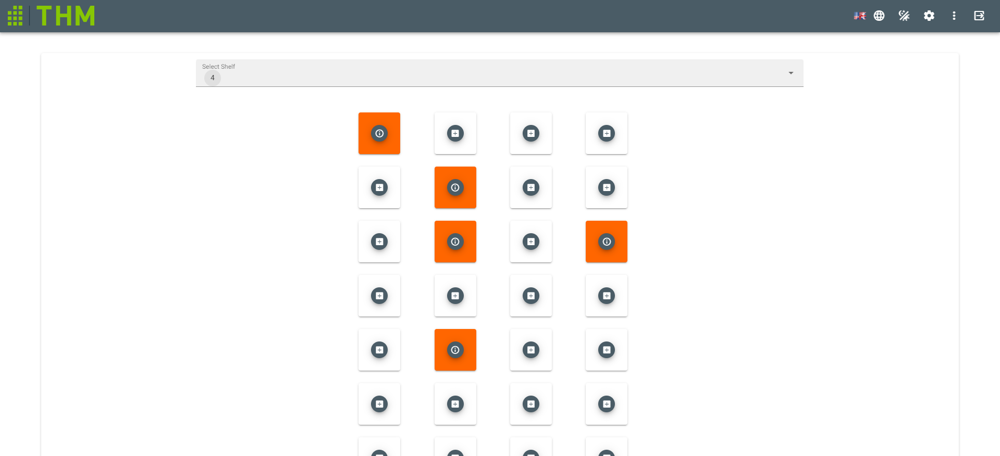

# ItemToShelf.vue Component
Assign Item to existing Shelves  

## Components
- `v-display`: displays the name of the Position
- `v-autocomplete`: selects an items from shelves
- `draggable`: drags an item to a position
- `div`: displays the element(item) from list

## Scripts
### watch
- `selectedShelf()`:selects all Shelfpositions for each Shelf from ShelfDirectDataService and adds it to Array
### created
- `created()`:creates an Event Listener to handle windowsize(resize)
### destroyed
- `destroyed()`:destroys an Event Listener to handle windowsize(resize)
### computed
- `sizeOfBox()`:gets the size of the box of the shelf depending of the windowsize
- `dragOptionsChips()`: Settings for the draggable Objects
### mounted
- `mounted()`: Gets all Shelves as Array via shelvesDataService
### methods
- `onResize`: sets the windowsize depending the innerhight/width
- `deleteItemFromPosition (x, y)`: deletes Item with Coordinate x,y from Position
- `updateShelf ()`: updates the Shelf after Position is filled with Item
- `occupied (x, y)`: Returns true if the filtered Array filed
- `checkOccupiedPositions`: checks the occupied Position in the selected Shelf
- `embeddedPositionNumber ()`: Returns PositionNumber according to Selected Position
- `fetchItemsFromLabels (labels : Label[])`: fills this.items with items which have all selected labels as Attributes
- `assignItem(item:Item)`: Assigns Item to Position in Backend

[_back to documentation_](../)

