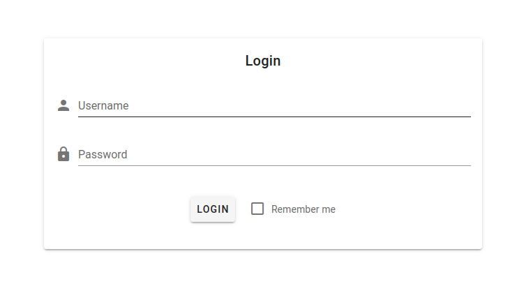
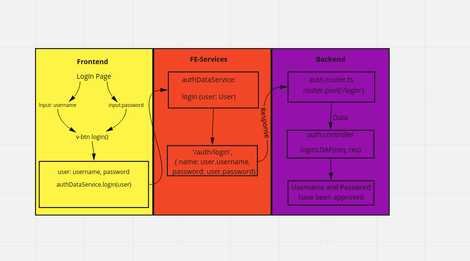

# Login.vue Component
Provides a login field with username and password.

## Components
- `v-text-field` -> Input field for Username and Password
- `v-btn` -> Button to submit the login
- `v-spacer` -> spacer between input fields and Buttons
    - which authorizes the user if in Database 
- `v-btn` -> Button to resume login via LDAP
    - authorizes the user with LDAP-Login
- `i18n` section -> Defines German/English text

## Scripts
- methods:
  - `register ()`:saves the input Data into the interface User and passes into the authDataService
  - `login ()`:saves the input Data into the interface User and passes into the authDataService
## Flowchart

[_back to documentation_](../)

