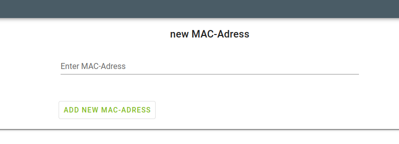

# Shelf Create

Creates a Mac-Address for the Shelf create Page. You can create Mac-Addresses under /MAC.

## Components
- Components
    - `v-text-field`: inputfield for the MACAddress
    - `v-btn`: submit Button to create a new MACAddress
    - `v-card-title`: the title of the Page
## Scripts
- methods:
    - `createMac ()`:creates a macAddress from the input field

[_back to documentation_](../)

