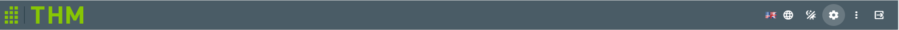
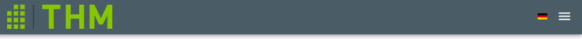

# NavigationBar

Defines the NavigationBar at the top of the page.

## Components
- `<NavigationBarLogo>` The logo of the page wrapped in a [component](./NavigationBarLogo.md)
- `<v-spacer>` to keep the middle of the Bar free
- `<v-img>` of changing country flags. Shows the actual, chosen language. A click on the flag changes the language with the `changeLocale` function
- The next four components are hidden on small and under that size screens because of `hidden-sm-and-down`attribute
    - `v-btn` world globe icon to change the language with the `changeLocale` function
    - `v-btn` day and night icon to switch dark mode with the `toggle_dark_mode`function on and off
    - `v-btn` settings icon links to the settings [component](Settings.md)
    - `v-btn` three dots used for open admin sidebar for switch between admin activities
- `v-navigation-drawer` shows what can admin do
  - `v-list-item-group` includes and displays these activities on drawer
  - `v-list-item` is container for items
  - `v-list-item-content` is container for items content
  - `v-list-title` displays title of list item
- On small and under that size Sceens a Hamburger Menu is visible, which opens a menü with copies of the three buttons before and the same functionality

## Scripts
- computed:
    - `imageSrc()`: Returns the path to the actual language flag icon, by combining the i18n locale setting with a file ending `.png`to the appropriate string
- methods:
    - `toggle_dark_mode()`: Assigns the negation of itself to itself
    - `changeLocale()`: Switches the i18n locale between `de`and `en`
- mounted: 
    - Checks if there is a dark mode preference in browser or system

[_back to wiki_](./)
