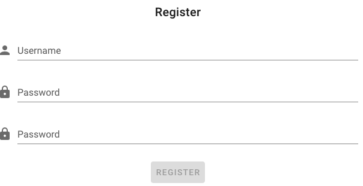
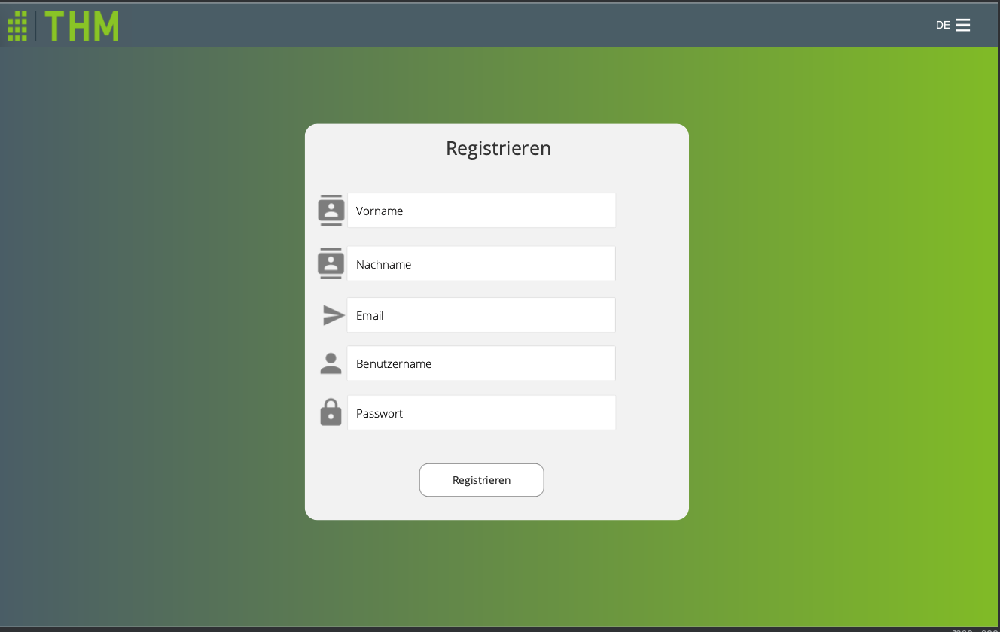

# Register.vue Component

Registration component with necessary fields to register a new user.
## Components
- `v-text-field` -> Input fields for First name, Last name, Username and Password
    - each field has a Rule, which flashes red if nothing has been written or didnt match the requirements    
- `v-spacer` -> spacer between input fields and Button
- `v-btn` -> Button to register
- `i18n` section -> Defines German/English text

## Script
-methods:
  - `register ()`:saves the input Data into the interface User and passes into the authDataService
## Mockup of Register Page (created 12/02/2021)

[_back to documentation_](../)

