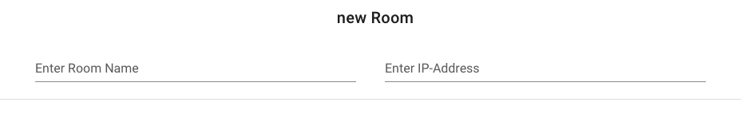

# Room

Creates a Roomname, which you can select in Shelf create. You can create a room in "/shelf" in the [Shelf](Shelf.md) component.

## Components
- Components
  - `v-text-field`: inputfield for the Roomname and IPAdress
  - `v-btn`: submit Button to create a new Room
  - `v-card-title`: the title of the Page
## Scripts
- methods:
    - `createRoom ()`:creates a Room and passes the response to DataService
- mounted: 
    - `RoomDataService.create(Room)`: sends the created Room into the DataService

[_back to wiki_](./)
