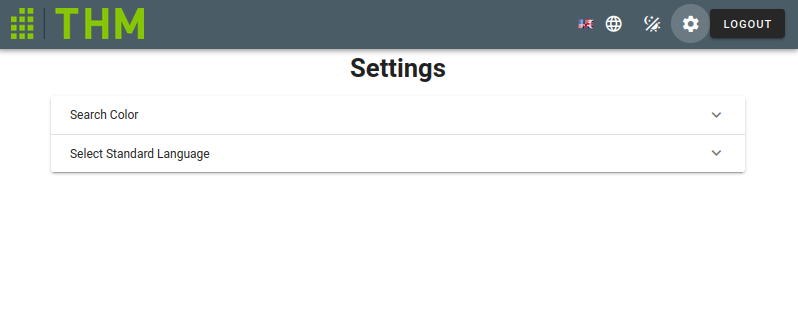
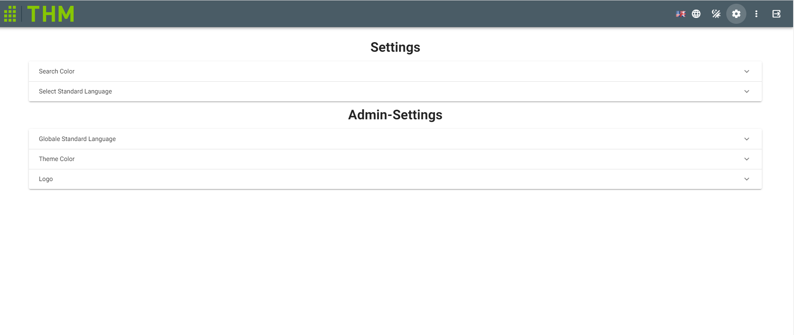
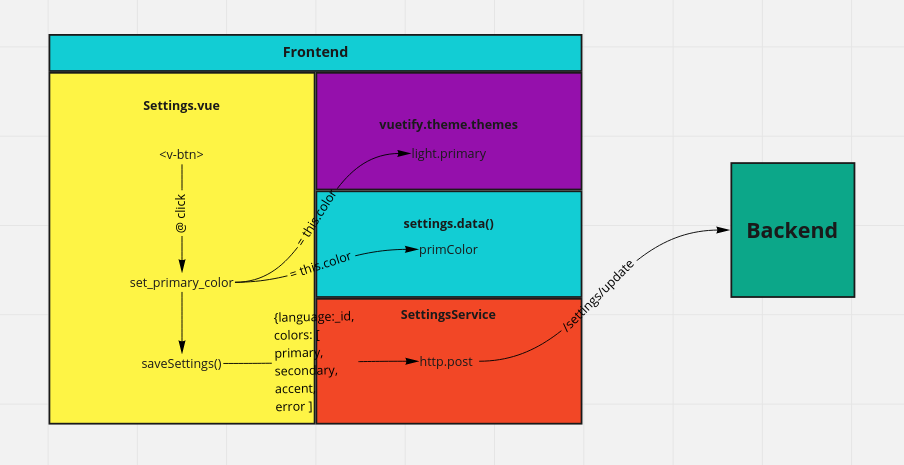

# Settings
Settings page with different setting options for the different user roles.

__Normal users__ 

- Can save a personal search color preference
- Select the standard language setting used when logged in

__Administrator__ 

- Can select and define the theme colors of the page
- Can upload a new logo for the [`NavigationBar`](NavigationBar.md) component
- Can set a standard language for the site

## Components
`<v-expansion-panel>` Dropdown selection for the different settings. Admin panels greyed out for normal users.

`<v-color-picker>` Used to select the different colors for the search color or theme colors options.

`<v-radio-group>` Radio buttons to select the preferred language
## Scripts
- __computed__:
    - __isAdmin__ Checks the role variable in the vuex store and returns true if the user is admin
- __methods__:
    - __fetchInfos__ Gets the settings and languages via the related services for further editing
    - __saveSettings__ Summarizes chosen settings and sends them via the SettingsService to the database
    - __set\_*\_color__ Functions to set and save the different colors
- __mounted__:
    - All color variables are set and synchronized with the database

## Flowchart
Example flow for the set_primary_color function

[_back to documentation_](../)

