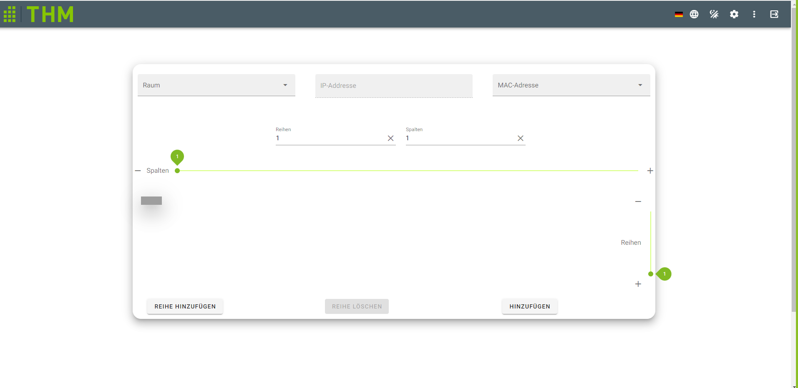

# Shelf.vue

Defines the Shelf which you can find under .../shelf

## Components
- Components:
  - `v-autocomplete`: AutoComplete SearchBar with Chips and slotted templates
  - `v-chip`: for selecting(Rooms, IPs, MACs) from the dropdown list
  - `templates`: Use this slot for the selected Labels inside V-Autocomplete -->
  - `v-list-item-action`: Enables CheckBox usage to select multiple labels
  - `v-dialog`: dialog for entering a new roomname, IP-Address
  - `v-text-field`:  for entering the Columns, Rows, Shelfname
  - `v-btn`: multiple buttons to add Rows, delete Rows, submit Shelf, increase/decrease Rows/columns
  - `v-sheet`: displays one piece of the shelf (max Rows/Columns 10, min Rows/Columns 1)
  - `v-icon`: displays icons for decreasing/increasing Rows/Columns
  - `v-slider`: to control the size of the shelf
  - `v-snackbar`: for displaying if the shelf creation was successful
    

## Scripts
- computed:
    - `isMobile()`: checks if screen size is mobile
    - `getCurrentNameString ()`: get the current name as string connected with i18n tag
    - `sizeOfBox()`: gets the size of the box of the shelf depending of the windowsize
    - `disableDeleteButton()`: disables delete Button when the amount of rows is 1
    - `disableAddRowButton()`: disables add Row Button when the amount of rows is higher than 9

- methods:
    -  `destroyed()`: destroys an Event Listener to handle windowsize(resize)
    - `created()`: creates an Event Listener to handle windowsize(resize)
    - `resetRowcounter ()`: resets the amount of rows
    - `resetSilder()`: resets the amount of columns
    - `openSnackbar ()`: opens a popup for shelf created
    - `submit ()`: resets  the form to default
    - `currentRowCounter ()`: currentRowCounter ()
    - `deleteRow ()`: decreases the size of the row and this function is executed with the 'delete row button'
    - `addRow ()`: increases the size of the row this function is executed with the 'add row button'
    - `incrementRows ()`:increases the size of the columns of the shelf is used in the vertical Row Slider
    - `decrementRows ()`: decreases the size of the rows of the shelf is used in the vertical Row Slider
    - `incrementColumns ()`: increases the size of the columns of the shelf is used in the horizontal Column Slider
    - `decrementColumns ()`: decreases the size of the columns of the shelf is used in the horizontal Column Slider
    - `onResize ()`: sets the windowsize depending the innerhight/width
    - `RoomsDataService.create(name)`: Creates an Room from the inputfield
    - `ShelfDataService.getAll()`: gets all Shelves
    - `createShelf ()`: creates shelf
    - `setSelectedLeds ()`:  sets selected LEDs (shown as Grid) in Color
    - `resetShelfLeds ()` :  turns off all LEDs
    - `createRoom()`: creates a Room with a name and ipAddress
    - `getMacAdresses (room)`: gets the current MacAddress depending of the selected Room
    - `getName (item: any)` : Used to get Name based on current language 
- mounted: 
    - `RoomDataService.getAll()`: connects with the RoomsDataService and returns all Rooms

- watch:
  
    - `selectedRoom (newRoom: any)`:gets the current selected Room
    - `selectedMacAdress ()`: gets all MAC addresses for this room
    - `slider ()`:  used for light up shelf on selected positions
    - `rowcounter ()`: used for reset light/light up shelf on selected positions

[_backtodocumentation_](../)

